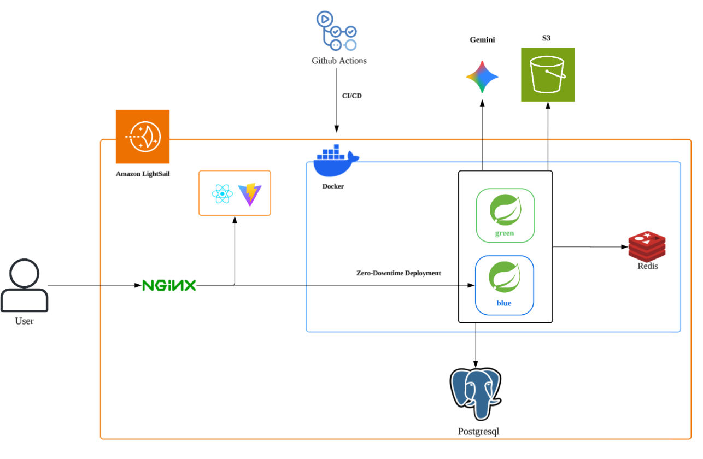

# Connected-BE

## 💡 Project Overview

Connecteamed는 복잡한 설정 과정을 최소화하여 누구나 쉽게 팀 프로젝트를 시작할 수 있게 돕고,
업무 과정에서 쌓인 데이터를 바탕으로 프로젝트의 시작부터 회고까지의 흐름을 관리해주는 팀 협업 관리 플랫폼입니다.

## 👥 Contributors

|                                                           **애나/김민선**                                                           |                                                              **정/김세정**                                                               |                                                               **현/류동현**                                                                |                                                                **막더/박상민**                                                                |
|:------------------------------------------------------------------------------------------------------------------------------:|:------------------------------------------------------------------------------------------------------------------------------------:|:--------------------------------------------------------------------------------------------------------------------------------------:|:----------------------------------------------------------------------------------------------------------------------------------------:|
| [ <br/> sunnyanna0](https://github.com/sunnyanna0) | [ <br/> sejeong223](https://github.com/sejeong223) | [ <br/> fbehdgus906](https://github.com/fbehdgus906) | [ <br/> sm010422](https://github.com/sm010422) |


## 🛠️ Tech Stacks

🧩 Language & Framework
     

🗄️ Database & Cache
 

🔐 Authentication
 

☁️ Infra & Deployment
  

🔄 CI/CD


🧪 Test


📦 Build Tool


## 📁 Project Structure

```text
Connected-BE/
├── src/
│   ├── main/
│   │   ├── java/com/connecteamed/server/
│   │   │   ├── domain/             # 도메인별 비즈니스 로직
│   │   │   │   ├── collaboration/  # 협업 관리
│   │   │   │   ├── contribution/   # 기여도 측정 및 관리
│   │   │   │   ├── dashboard/      # 대시보드
│   │   │   │   ├── document/       # 공유 문서 관리
│   │   │   │   ├── invite/         # 팀/프로젝트 초대
│   │   │   │   ├── meeting/        # 회의록 관리
│   │   │   │   ├── member/         # 사용자 계정 관리
│   │   │   │   ├── mypage/         # 마이페이지 및 개인 설정
│   │   │   │   ├── notification/   # 알림 서비스
│   │   │   │   ├── project/        # 프로젝트 생성 및 관리
│   │   │   │   ├── retrospective/  # 프로젝트 회고 관리
│   │   │   │   ├── task/           # 업무 관리
│   │   │   │   ├── team/           # 팀 구성 및 관리
│   │   │   │   └── token/          # JWT/Refresh 토큰 처리
│   │   │   ├── global/             # 전역 설정 및 공통 모듈
│   │   │   │   ├── apiPayload/     # 공통 응답(Success/Error) 규격
│   │   │   │   ├── auth/           # 보안 인증/인가 로직
│   │   │   │   ├── config/         # 프레임워크 및 인프라 설정
│   │   │   │   ├── entity/         # 공통 엔티티(BaseTime 등)
│   │   │   │   └── util/           # 범용 유틸리티 함수
│   │   │   └── ConnecteamedApplication.java
│   │   └── resources/
│   │       ├── prompts/            # AI 모델용 프롬프트 관리
│   │       ├── static/             # 테스트용 정적 리소스(HTML)
│   │       └── application.yaml    # 시스템 환경 설정
│   └── test/                       # 테스트 코드 유닛 및 통합 테스트
└── build.gradle                    # 빌드 스크립트 및 의존성 관리
```

## ⚙️ Server Architecture

<div align="center">  </div>

## 📢 Convention

본 프로젝트는 아래의 Git 및 협업 규칙을 따릅니다.

## Git 규칙 (Commit Convention)


## 1. 커밋 메시지 구조


```
type(scope): subject  <-- 제목 (필수)
body                  <-- 본문 (선택: 자세한 설명이 필요할 때)
footer                <-- 꼬리말 (선택: 이슈 번호 닫을 때)
```


### 1-1. Type (태그) 상세 정의

가장 많이 쓰이는 표준(Conventional Commits)을 따릅니다.

- `feat`: 새로운 기능 추가 (사용자에게 영향을 미침)
- `fix`: 버그 수정 (사용자에게 영향을 미침)
- `docs`: 문서 수정 (README.md, JavaDoc, Swagger 등)
- `style`: 코드 포맷팅, 세미콜론 누락, 들여쓰기 등 (비즈니스 로직 변경 없음)
- `refactor`: 코드 리팩토링 (기능 변경 없이 코드 구조만 개선)
- `test`: 테스트 코드 추가 및 리팩토링
- `chore`: 빌드 설정(Gradle/Maven), 패키지 매니저 설정, 단순 파일 이동 등
- `ci`: CI 구성 파일 및 스크립트 변경
- `perf`: 성능 개선

### 1-2. 작성 예시

- **Good:** `feat(auth): 카카오 소셜 로그인 API 구현` (범위 명시, 명확한 행위)
- **Bad:** `feat: 로그인` (너무 포괄적임)

---

## 2. 브랜치 전략 (Git Flow + Naming)

Git Flow 전략을 기반으로 운영합니다.
브랜치명만 보고도 어떤 작업을 하는지 알 수 있도록 **이슈 번호**를 포함하는 것을 권장합니다.

### 2-1. 주요 브랜치

- **`main`**: 배포 가능한 상태의 코드 (Production)
- **`develop`**: 다음 배포를 위해 개발 중인 코드 (Integration)

### 2-2. 보조 브랜치 명명 규칙 (Naming Convention)

`develop` 브랜치에서 분기하여 작업 후 PR을 보냅니다.

- **Feature**: `feat/이슈번호-기능명`
    - ex) `feat/12-social-login`
- **Fix**: `fix/이슈번호-버그명`
    - ex) `fix/34-websocket-error`
- **Hotfix**: `hotfix/이슈번호-급한버그` (main에서 바로 분기 시)

---

## 3. 이슈(Issue) 작성 규칙

제목만으로는 작업 내용을 알 수 없습니다. 템플릿을 정해두는 것이 좋습니다.

### 3-1. 이슈 제목

- `[Feat] 기능명` : 새로운 기능
- `[Fix] 버그명` : 버그 수정
- `[Refactor] 대상` : 리팩토링
- `[Chore] 작업명` : 기타 설정

### 3-2. 이슈 본문 템플릿

```
## 💡 개요
- (작업의 목적, 배경, 혹은 해결하려는 버그를 간략히 설명합니다.)

## 📋 작업 상세 내용
- [ ] 세부 작업 내용 1
- [ ] 세부 작업 내용 2
- [ ] 세부 작업 내용 3

## 🔗 참고 사항
- (Jira 티켓, 디자인 시안, 관련 링크 등)

```

---

## 4. PR(Pull Request) 규칙

- **제목:** `[Feat] 카카오 로그인 기능 구현 (#이슈번호)`
- **내용:**
    - 작업한 내용 요약
    - 집중적으로 리뷰해줬으면 하는 부분
    - 테스트 방법 (Postman 스크린샷 등)
